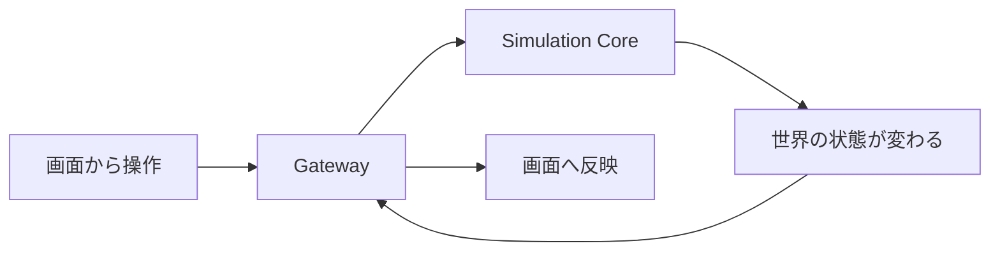

  

  

<h1 align="center">MachiVerse</h1>

  <strong>この街が、ここにある理由までシミュレーションしたい。</strong>

  人、自然、社会、経済、都市、歴史。 
  それぞれがつながって変化していく「生きている世界」を目指す、オープンソースの世界シミュレーションプロジェクトです。

  
  
  

  <a href="https://machiverse.app"><strong>Website</strong></a>
  ・
  <a href="ROADMAP.md"><strong>Roadmap</strong></a>
  ・
  <a href="https://github.com/MachiVerse-Project/MachiVerse/discussions"><strong>Discussions</strong></a>
  ・
  <a href="DEVELOPMENT.md"><strong>For Developers</strong></a>

---

## もし、街に本当の歴史があったら？

ここに街があるのは、誰かが最初から置いたからじゃない。

近くに水があったからかもしれない。
土地が暮らしやすかったからかもしれない。
人が集まり、仕事が生まれ、道ができたからかもしれない。

そして、その街で暮らす人たちにも、それぞれの生活がある。

誰かが働く。
誰かが物を運ぶ。
誰かが引っ越してくる。
誰かが新しいことを始める。

そんな小さな出来事が積み重なって、街や社会は少しずつ変わっていく。

**MachiVerseは、「完成した世界を用意する」のではなく、「世界が世界になっていく過程」をシミュレーションしたいプロジェクトです。**

  <strong>「世界を作る」のではなく、「世界がそうなった理由」までシミュレーションする。</strong>

---

## こんな世界を作りたい

### 人が住み始める

ある場所に水がある。
土地がある。
暮らしていけそうな環境がある。

そこに人が住み始める。

### 人が集まれば、必要なものが増える

食べ物が必要になる。
住む場所が必要になる。
物を作る人、売る人、運ぶ人が必要になる。

人の暮らしが、仕事や経済を生み出していく。

### やがて、街になる

人が行き来する場所には道ができる。
物が集まる場所には市場ができるかもしれない。
人が増えれば、組織や制度も必要になるかもしれない。

最初は小さな集落だった場所が、長い時間の中で街へ変わっていく。

### でも、ずっと同じではない

資源が減るかもしれない。
産業が変わるかもしれない。
新しい交通路ができて、人の流れが変わるかもしれない。

栄える街もあれば、静かになっていく街もある。

そして、その変化が次の時代へ残っていく。

**何十年、何百年と時間を進めた先に、「なぜこの世界は今こうなっているのか」をたどれる世界。**

それが、MachiVerseが目指しているものです。

> [!NOTE]
> ここで紹介しているのはMachiVerseの長期的な世界像です。すべてが現在のAlpha 1.0で実装済みという意味ではありません。

---

## そして、あなたもその世界へ

MachiVerseでは、世界へ参加する利用者を **「ダイバー」** と呼びます。

でも、世界の外から街を好きに作り替える存在ではありません。

あなたが入るのは、**その世界ですでに暮らしている一人の住民**です。

仕事があるかもしれない。
家族や知り合いがいるかもしれない。
誰かとの関係や、それまで生きてきた時間があるかもしれない。

その人として、世界の中で行動していく。

そして、あなたが接続を終えても、世界そのものが消えるわけではありません。

  <strong>あなたが見ていない間も、世界は続いていく。</strong>

そんな体験を目指しています。

---

## 世界は、いろいろなものがつながってできている

MachiVerseでは、自然、住民、社会、経済、都市などを別々の背景設定として置くだけにはしたくありません。

たとえば、

- 地形や水、気候が、人の住みやすさに影響する
- 人が集まれば、需要や仕事が生まれる
- 仕事や産業が、人や物の移動を増やす
- 移動が増えれば、道や街の形が変わる
- 街の変化が、そこで暮らす人の生活をまた変える

そんなふうに、**一つの変化が別の変化につながっていく世界**を作っていきます。

世界の「今」だけでなく、そこへ至った過程も大切にします。

---

## ところで、これ本当に動いてるの？

まだ、巨大な世界を自由に遊べる段階ではありません。

でも、構想だけのプロジェクトでもありません。

現在の **Alpha 1.0** では、MachiVerseを動かすための最初の一周が、実際のコンポーネント同士で動いています。

つまり、

**世界を見る → 行動する → シミュレーションが受け取る → 世界が変わる → その結果が返ってくる**

という基礎ループが成立しています。

Alpha 1.0では、Simulation Core / Gateway / General View / Administration View が実際に接続され、WorldStateの更新、状態配信、永続化、再起動後のrecoveryなども確認できています。

技術的な詳細や起動方法は、一般向けREADMEから分離しています。

[Alpha 1.0を動かしてみる → DEVELOPMENT.md](DEVELOPMENT.md)

---

## これから増えていく世界

MachiVerseでは、これから少しずつ「世界を世界らしくするもの」を増やしていきます。

| 領域 | 目指していること |
| --- | --- |
| **自然** | 地形、水、気候、生態系が暮らしへ影響する |
| **住民** | 一人ひとりが生活し、知識や記憶、目的を持つ |
| **社会** | 家族、仕事、組織、教育などの関係が生まれる |
| **経済** | 資源、生産、物流、市場などがつながる |
| **街** | 建物、交通、インフラが人の営みの結果として変わる |
| **制度・文化** | 法、行政、政治、文化が社会の中で形づくられる |
| **歴史** | 出来事が記録され、その影響が未来へ残る |

これは単に「機能をたくさん追加する」という話ではありません。

**それぞれが影響し合って、一つの世界として動くこと。**

そこを大事にしながら作っていきます。

詳しい計画は [`ROADMAP.md`](ROADMAP.md) から確認できます。

---

## MachiVerseを覗いてみる

気になるところからどうぞ。

| 興味 | 入口 |
| --- | --- |
| これから何を作るのか見たい | [Roadmap](ROADMAP.md) |
| Alpha 1.0を動かしてみたい | [Development Guide](DEVELOPMENT.md) |
| 世界シミュレーションの設計を読みたい | [Design Documents](docs/README.md) |
| 開発に参加したい | [Contribution Guide](CONTRIBUTING.md) |
| アイデアや質問を話したい | [GitHub Discussions](https://github.com/MachiVerse-Project/MachiVerse/discussions) |
| Webサイトを見たい | [machiverse.app](https://machiverse.app) |

---

## 一緒に作る

MachiVerseはオープンソースで開発しています。

コードを書く人だけが参加者ではありません。

実装、設計、検証、UI、可視化、ドキュメント、アイデア、質問。

いろいろな形でプロジェクトに関われます。

開発へ参加する場合は、まず [`CONTRIBUTING.md`](CONTRIBUTING.md) をご覧ください。

---

## Developers

開発者向け情報は [`DEVELOPMENT.md`](DEVELOPMENT.md) にまとめています。

MachiVerseの主要技術は **C# / .NET 10** です。General Viewでは **Blazor WebAssembly + three.js** を使用しています。

より詳しい設計は [`docs/README.md`](docs/README.md)、リポジトリの開発ルールは [`AGENTS.md`](AGENTS.md) を参照してください。

---

## License

MachiVerse is licensed under the [Apache License 2.0](LICENSE).
