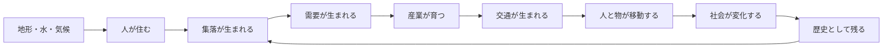
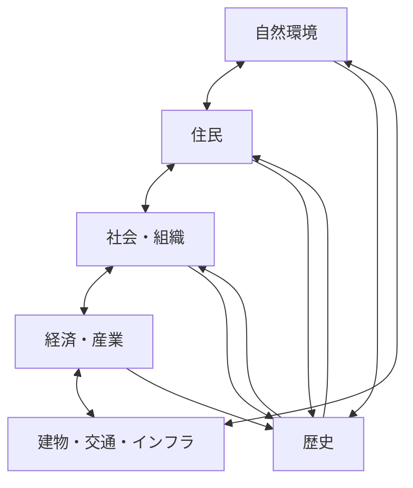
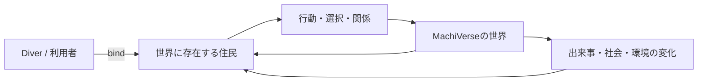
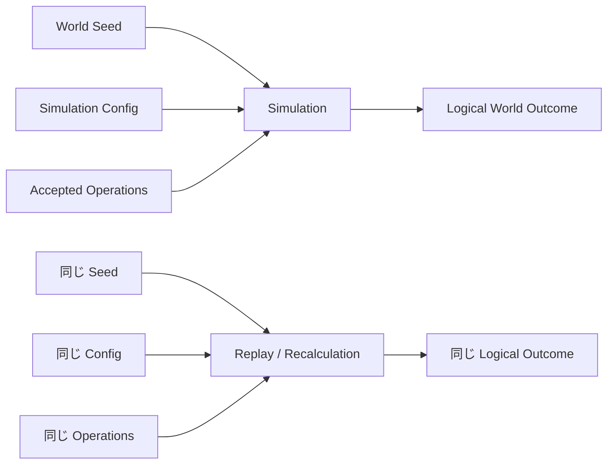
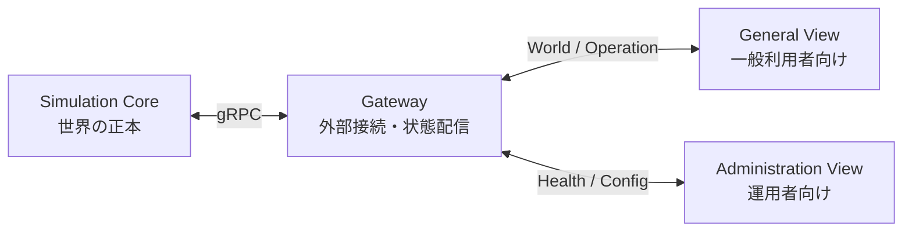
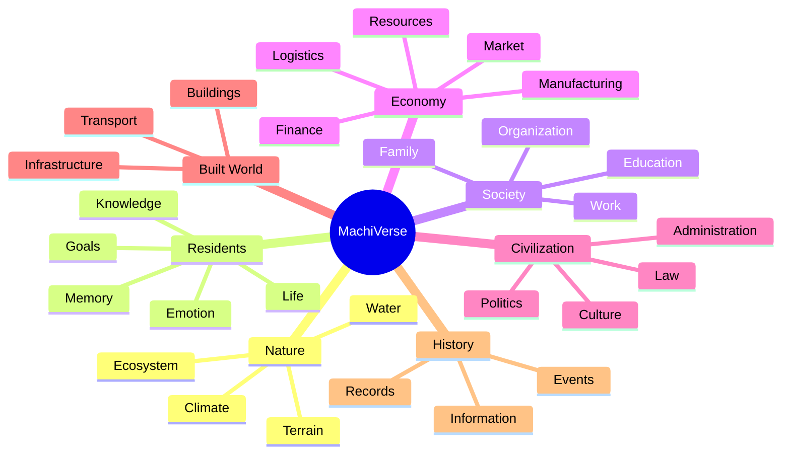

  

  

<h1 align="center">MachiVerse</h1>

  <strong>世界を、状態の集合ではなく、因果と歴史を持つ動的なシステムとしてシミュレーションする。</strong>

  「世界を作る」のではなく、<strong>「世界がそうなった理由」までシミュレーションする。</strong>

  
  
  
  

  <a href="https://machiverse.app"><strong>Website</strong></a>
  ・
  <a href="ROADMAP.md"><strong>Roadmap</strong></a>
  ・
  <a href="https://github.com/MachiVerse-Project/MachiVerse/discussions"><strong>Discussions</strong></a>
  ・
  <a href="DEVELOPMENT.md"><strong>For Developers</strong></a>

---

## 世界は、最初から完成していない。

なぜ、この場所に街があるのか。

なぜ、この人はここで暮らしているのか。

なぜ、ある産業が栄え、別の場所は衰退したのか。

なぜ、今の社会や文化がこの形になったのか。

**MachiVerse** は、それらを最初から用意された背景設定ではなく、**過去から積み重なった出来事と相互作用の結果として生み出すこと**を目指す、エージェントベースの大規模世界シミュレーションプロジェクトです。

自然、人、社会、経済、都市、情報、歴史。

それぞれを独立した飾りとして置くのではなく、互いに影響し続ける一つの世界としてつなげていきます。

> [!NOTE]
> 上の図は、MachiVerseが重視する「因果がつながる世界」を分かりやすく表した概念図です。個々の因果関係を固定したゲームルールとして示すものではありません。

---

## MachiVerseが目指している世界

### 現在には、歴史がある

都市や集落、住民、自然環境を「最初からそこにある完成物」として扱いません。

過去の状態と選択から現在が生まれ、現在の出来事が未来へ残っていく世界を目指します。

### 人々は、背景ではなく世界の一部

住民は世界を彩るだけのNPCではなく、それぞれが世界の中に存在するエージェントです。

人の行動が家族、仕事、組織、経済、社会へ影響し、それらの変化が再び人の生活へ返ってくる世界を目指します。

### 自然と人の営みを切り離さない

地形、水、気候、資源、生態系などは単なる背景ではありません。

人がどこに住み、何を生産し、どこへ移動し、どんな街が生まれるのか。その土台となる世界状態として扱います。

### 都市だけが世界ではない

都市、集落、農村、自然地域などが同じ世界の中に存在し、互いの需要や移動、環境、歴史によって関係していく世界を考えています。

> [!IMPORTANT]
> このセクションは **MachiVerseが長期的に目指している世界像** です。すべてが現在のAlpha 1.0で実装済みという意味ではありません。

---

## 世界の外から操るのではなく、世界の中へダイブする

MachiVerseでは、世界へ参加する利用者を **「ダイバー」** と呼びます。

ダイバーは、世界を自由に編集する神のような存在ではありません。

**すでにMachiVerseの世界で暮らしている一人の住民へ参加し、その人として世界の時間、社会、関係、出来事の中に存在する**ことを目指します。

接続をやめても、その住民や世界そのものが消えるわけではありません。

**あなたが見ていない間にも世界は続いている。**

そんな体験を目指しています。

---

## 「同じ世界」を、もう一度たどれるようにする

MachiVerseでは、シミュレーションの**決定論**を重要な基本契約として扱います。

同じWorld Seed、同じシミュレーション設定、同じ受理された操作と適用条件からは、同じ論理的な世界結果へ収束することを目指します。

これは、世界の歴史を追跡し、再現し、検証できるシミュレーションを成立させるための重要な考え方です。

---

# 現在の開発状況 — Alpha 1.0

MachiVerseは、まだ完成した巨大世界を遊べる段階ではありません。

一方で、**構想や設計だけの段階でもありません。**

現在の `develop` には、Simulation Core / Gateway / General View / Administration View を実際に接続した、最初の再現可能な **Alpha 1.0 vertical slice** が入っています。

### Alpha 1.0で実際に動いているもの

- Simulation Core ↔ Gateway の実gRPC接続
- General View / Administration View の実ブラウザセッション
- confirmed world の `FULL` / `DELTA` 配信
- Diver の最小参加Operation
- authoritative WorldState の更新とViewへの反映
- View側predictionとconfirmed stateのreconciliation
- Configの参照・変更と競合拒否
- Core / Gateway の永続化、停止、再起動、recovery、resync
- 不正・失効セッション等を拒否するfail-closed処理

つまり現在は、

**世界の状態 → 利用者の操作 → シミュレーション → 世界の変化 → 画面への反映**

という、MachiVerseを成立させるための基礎ループが実コンポーネント間で動いています。

> [!WARNING]
> Alpha 1.0は完成版MachiVerseではありません。大規模Resident / economy / governance scenario、polished UI、都市・アセット・世界コンテンツ、production向け性能調整などは今後の開発領域です。

[Alpha 1.0の技術詳細・起動方法を見る →](DEVELOPMENT.md)

---

## これから世界へ増えていくもの

MachiVerseの設計では、世界を構成する多くの領域を互いに独立した背景値ではなく、因果的につながるシミュレーション対象として考えています。

これは「機能一覧を埋める」ための計画ではありません。

**自然が暮らしへ影響し、暮らしが社会を作り、社会が経済や都市を変え、その結果が自然や次の世代へ返っていく。**

そうしたつながりを増やしながら、一つの世界として成立させていきます。

詳しい計画は [`ROADMAP.md`](ROADMAP.md) と [`docs/README.md`](docs/README.md) を参照してください。

---

## MachiVerseを覗いてみる

興味の方向に合わせて、入口を選べます。

| 興味 | 入口 |
| --- | --- |
| 今後どう発展していくのか知りたい | [Roadmap](ROADMAP.md) |
| Alpha 1.0を起動してみたい | [Development Guide](DEVELOPMENT.md) |
| 世界シミュレーションの設計を読みたい | [Design Documents](docs/README.md) |
| 開発に参加したい | [Contribution Guide](CONTRIBUTING.md) |
| アイデアや質問を話したい | [GitHub Discussions](https://github.com/MachiVerse-Project/MachiVerse/discussions) |
| プロジェクトのWebサイトを見たい | [machiverse.app](https://machiverse.app) |

---

## Developers

MachiVerseはオープンソースで開発しています。

主要な実装技術は **C# / .NET 10**。General Viewでは **Blazor WebAssembly + three.js** を使用し、コンポーネント間はversioned Protocol / schemaを境界として設計しています。

技術情報はトップREADMEから分離しました。

- [`DEVELOPMENT.md`](DEVELOPMENT.md) — Alpha 1.0、Quick Start、コンポーネント、開発者向け情報
- [`CONTRIBUTING.md`](CONTRIBUTING.md) — Issue / Pull Request / Discussion、開発参加ルール
- [`docs/README.md`](docs/README.md) — Requirements / Architecture / Protocol / World Simulation設計
- [`AGENTS.md`](AGENTS.md) — リポジトリ開発ルール

---

## Contributing

コードを書く人だけが参加者ではありません。

実装、設計、検証、可視化、UI、ドキュメント、アイデア、質問など、さまざまな形での参加を歓迎します。

具体的な実装対象として整理できる内容はIssueへ、まだアイデア段階の話や設計議論、質問はGitHub Discussionsへどうぞ。

[Contribution Guideを読む →](CONTRIBUTING.md)

[GitHub Discussionsへ →](https://github.com/MachiVerse-Project/MachiVerse/discussions)

---

  

  <strong>世界が生まれ、変わり、歴史になる。</strong> 
  MachiVerseは、その過程そのものをシミュレーションする世界を目指しています。

  <a href="https://machiverse.app">Website</a>
  ・
  <a href="https://github.com/MachiVerse-Project/MachiVerse/discussions">Discussions</a>
  ・
  <a href="ROADMAP.md">Roadmap</a>

## License

MachiVerse is licensed under the [Apache License 2.0](LICENSE).
